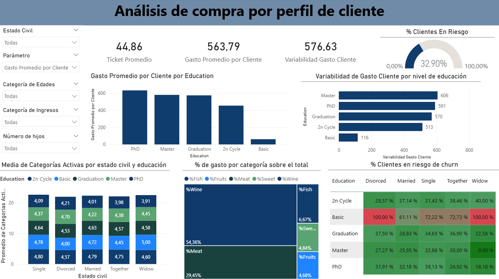

<h1 align="center">Análisis de perfil de clientes</h1>

## 1. Descripción
Se plantean cinco preguntas de negocio centradas en el perfil del cliente con la finalidad de analizar cómo las características demográficas influyen en el comportamiento de compra, lo que permite identificar segmentos claves y oportunidades de optiminzación en las estrategias de marketing.

- **1.** ¿Qué nivel educativo presenta mayor valor económico para la empresa?
- **2.** ¿Qué combinación de nivel educativo y estado civil genera mayor valor para la empresa?
- **3.** ¿Qué perfiles de clientes muestran mayor estabilidad en su comportamiento de compra?
- **4.** ¿Qué perfiles de clientes presentan mayor diversificación de consumo?
- **5.** ¿Qué perfiles de clientes presentan mayor riesgo de abandono?

---
## 2. Dataset

El dataset contiene información sobre características demográficas de los clientes y su comportamiento de compra en diferentes categorías de productos.

Variables principales utilizadas en el análisis:
- Nivel educativo del cliente
- Estado civil
- Segmentación por ingresos
- Número de hijos
- Compras en categorías como Wine, Meat, Fish, Fruits y Sweet

Estas variables permiten analizar cómo las características del cliente influyen en su comportamiento de compra y en su nivel de gasto.

---
## 3. Herramientas Utilizadas
- Power BI- DAX (Data Analysis Expressions)

**Vista del Dashboard**

---
## 4. Análisis

El dashboard presenta diferentes métricas y visualizaciones que permiten comprender el comportamiento de compra de los clientes:

Métricas principales
- Ticket promedio
- Gasto promedio por cliente
- Variabilidad del gasto por cliente
- Porcentaje de clientes en riesgo

Análisis realizados:
- Comparación del gasto promedio según nivel educativo
- Variabilidad del gasto por perfil educativo
- Distribución del gasto por categoría de producto
- Promedio de categorías activas por estado civil y nivel educativo
- Identificación de clientes con mayor riesgo de churn
Además, el dashboard incluye filtros interactivos para analizar los resultados según el estado civil, categoría de edad, categoría de ingresos y número de hijos

---
## 5. Hallazgos

A partir del análisis realizado se identificaron algunos patrones relevantes:
- Los clientes con mayor nivel educativo tienden a presentar mayor gasto promedio.
- La categoría de productos Vino representa la mayor proporción del gasto total.
- Existen diferencias importantes en el comportamiento de compra según el estado civil.
Algunos segmentos de clientes presentan mayor variabilidad en el gasto, lo que podría indicar patrones de consumo menos estables.
Estos resultados permiten identificar segmentos de clientes relevantes y apoyar estrategias de marketing más focalizadas.
